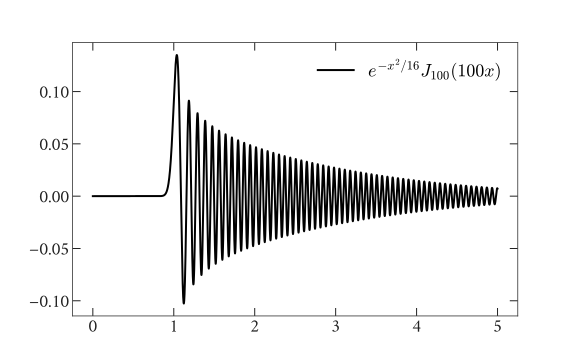

```@meta
CurrentModule = OscillatoryIntegralsODE
```

# OscillatoryIntegralsODE

This package performs highly oscillatory quadrature by combining a Levin method ([Levin 1994](https://www.sciencedirect.com/science/article/pii/0377042794001189)) with an ODE solver. It currently supports Bessel, spherical Bessel, and harmonic integrals. Gaussian quadrature is inefficient for such integrals, requiring special methods. We show an example integrand involving a Bessel function, below.

```@raw html
<p align="center">

</p>
``` ⠀
